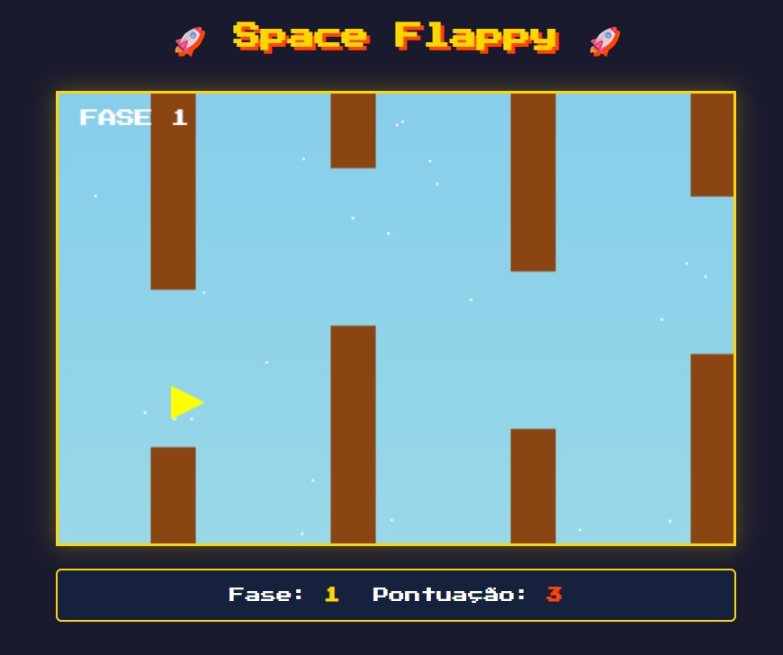
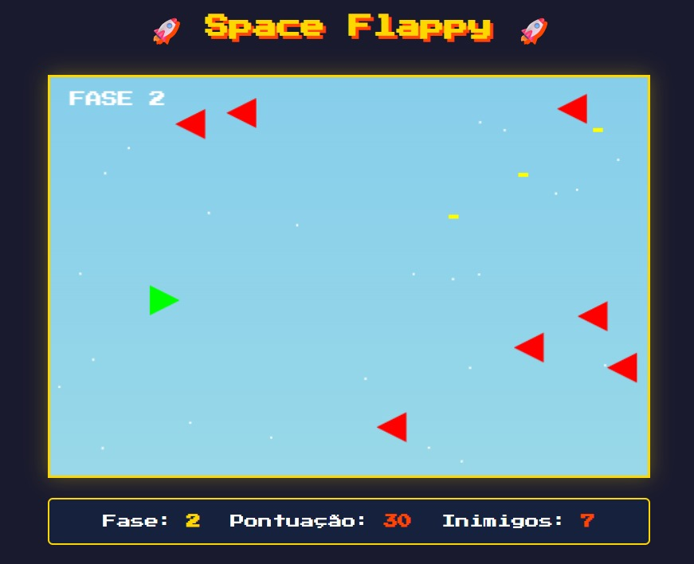

# Space-Flappy
Projeto antigo de um jogo simples inspirado nos clássicos de "space shooters" e Flappy Bird, foi desenvolvido utilizando as linguagens:

## Interfaces

### Menu

O menu contém as instruções de jogo, um seletor de fases e o recorde da fase 2.

  

### Gameplay

Tela mostrando a Fase 1, com a pontuação exibindo a quantidade de obstáculos passados.

  

Tela mostrando a Fase 2, com a pontuação atual (Cada abate vale 10 pontos) e os inimigos restantes.

  

## Para fazer:

1. Salvar recorde de pontuação da fase 1.
